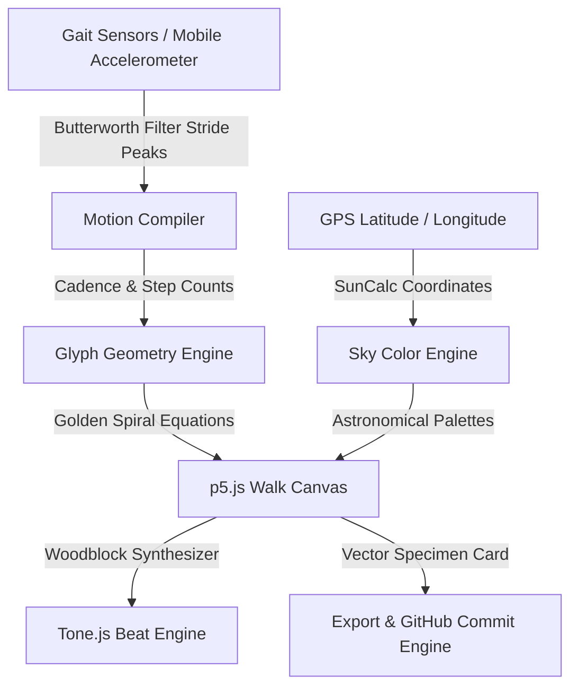

# GLYPH — A Computational Camera for Movement

> **"Commit to touching grass."**  
> Every walk leaves behind a Mandala Commit.

GLYPH is a creative technology web application that acts as a computational lens for your physical movement. It translates your footsteps, cadence, location, and the position of the sun into a deterministic, procedurally-generated mathematical mandala. When your walk is complete, the mandala is serialized as a vector asset and committed directly to your GitHub repository—making physical presence a tracked contribution.

Built for the **Prism Hackathon**, GLYPH encourages engineers to log off, step outside, and record their walks as beautiful, collectible data specimens.

---

## 🎨 Creative Philosophy

In a world obsessed with digital activity trackers, screen-time metrics, and gamified steps, GLYPH shifts the focus toward organic contemplation. By linking your GitHub contribution graph—traditionally a symbol of keyboard productivity—to the act of walking outdoors, GLYPH invites you to:

1.  **Step Outside:** Turn code contributions into footsteps.
2.  **Acknowledge the Sky:** Let the exact location and solar angle shape your colors.
3.  **Generate Specimen Art:** Build beautiful, deterministic geometries based on golden spiral equations.

---

## ⚙️ Core Engines & Mechanics

GLYPH is structured as a collection of decoupled computational engines, keeping React solely responsible for presentation layouts:



### 1. Geometry Engine
The geometry of your mandala is determined by the **Golden Spiral / Phyllotaxis** equations. As you walk, coordinates are plotted procedurally:
\[r = c\sqrt{n}\]
\[\theta = n \times 137.508^\circ\]
*   `n` is the current step count.
*   `c` is a scaling factor responsive to your gait cadence (BPM).
*   As your step counts cross Fibonacci milestones, the engine replicates arms into symmetric mandala patterns.

### 2. Sky Engine
GLYPH evaluates your device GPS coordinates and maps them to astronomical sun angles relative to your horizon using SunCalc:
*   **Golden Hour:** Warm sunflower golds and morning rusts.
*   **Blue Hour:** Translucent violet indigos.
*   **Night Walk:** Deep midnight blues and stardust white.
*   **Daylight:** Bright nature greens and sky blues.

### 3. Beat Engine
An interactive procedural audio synthesizer built on **Tone.js**. Every footstep triggers a resonant woodblock chime, accompanied by chord progression echoes synced with your cadence. Walking faster creates a brighter, higher-tempo acoustic feedback loop.

### 4. Commit Engine
When you end your walk, GLYPH:
1.  Serializes the canvas into a deterministic vector SVG asset.
2.  Appends walk metrics (Step count, Cadence, Solar palette, Duration) as Markdown frontmatter metadata.
3.  Commits the specimen file directly to your GitHub repository as a `Mandala Commit` using GitHub OAuth.

---

## 🛠️ Technology Stack

*   **Framework:** Next.js 16 (Turbopack) & React 19
*   **Language:** TypeScript (Strict Mode)
*   **Styling:** Tailwind CSS v4 & CSS Design Tokens
*   **Canvas Rendering:** p5.js (Client-side ESM integration)
*   **Audio Synthesis:** Tone.js
*   **Sun Angle Analysis:** SunCalc
*   **Storage & Auth:** Supabase & GitHub OAuth
*   **Test Suite:** Vitest (100% deterministic geometry verification)

---

## 🚀 Getting Started & Local Setup

To run GLYPH on your machine:

### 1. Clone & Install
```bash
git clone https://github.com/ayatinkering/GLYPH.git
pnpm install
```

### 2. Configure Environment Variables
Create a `.env.local` file in the root directory:
```env
NEXT_PUBLIC_SUPABASE_URL=your-supabase-url
NEXT_PUBLIC_SUPABASE_ANON_KEY=your-supabase-anon-key
SUPABASE_SERVICE_ROLE_KEY=your-supabase-service-role
GITHUB_CLIENT_ID=your-github-oauth-id
GITHUB_CLIENT_SECRET=your-github-oauth-secret
```

### 3. Run Development Server
```bash
npm run dev
```
Open **[http://localhost:3000](http://localhost:3000)** to view the page.

---

## 📱 Mobile Testing (DeviceMotion Acceleration)

Since mobile Safari and Chrome require an **HTTPS secure context** to grant access to the `DeviceMotionEvent` sensors, you must tunnel your localhost to test real footstep detection outside:

1.  Start your local server: `npm run dev` (running on port `3000`).
2.  In a separate terminal, launch a secure ngrok tunnel:
    ```bash
    npx ngrok http 3000
    ```
3.  Scan the generated HTTPS URL on your phone, authorize motion sensors, and start walking!

---

## 🧪 Mathematical Verification (Tests)

We enforce mathematical determinism on the Phyllotaxis engine to ensure that identical walks always produce identical mandala layouts. To run the geometry unit checks:

```bash
npm run test
```

All calculations pass with 100% consistency:
```text
✓ src/engine/geometry/GeometryEngine.test.ts (3)
   ✓ GeometryEngine
     ✓ should calculate deterministic coordinates for the Golden Spiral
     ✓ should adapt scaling factor responsive to step cadence
     ✓ should replicate arms into symmetric Fibonacci branches
```
